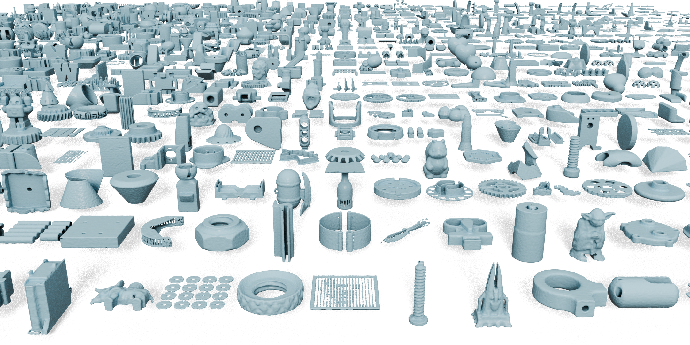

# NeCGS: Neural Compression for 3D Geometry Sets [[Arxiv]](https://arxiv.org/abs/2405.15034)
### Decompressed Meshes   

 

  

### Regular Geometry Representation

Prepare mesh data, and put them in a folder.

- Mesh_path
  - 0000.obj
  - 0001.obj
    ......

Then run the following command to optimize each TSDF-Def volume,

`python optimize_tsdf_offset.py --data_path=/path/to/your/data --save_path=/path/to/save`

### Compact Neural Representation

Chnage the data_path in configs/configs.txt, then run the following command,

`python train_quant.py --config=configs/configs.txt`
